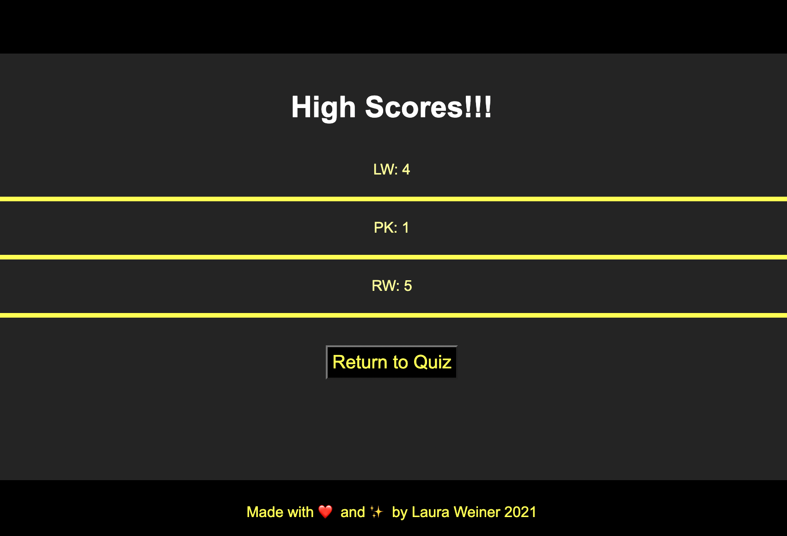

# JavaScript Code Quiz

[Link to finished website](https://lweine01.github.io/code-quiz/)

## Table of Contents
- [Description](#Description)
- [Screenshots](#Screenshots)
- [Usage](#Usage)
- [Language](#language)

## Description
In this assignment, I created a simple JavaScript code quiz to test the users knowledge. 
The user has 60 seconds to complete the quiz and loses 5 seconds for every wrong answer.
At the end of the quiz they can subit their initials to be logged in the highscores page.
Click retake quiz to start again.

## Screenshots

## Usage
This website provides a simple quiz to test the users knowledge of JavaScript.

## Language
HTML, CSS and Javascript
